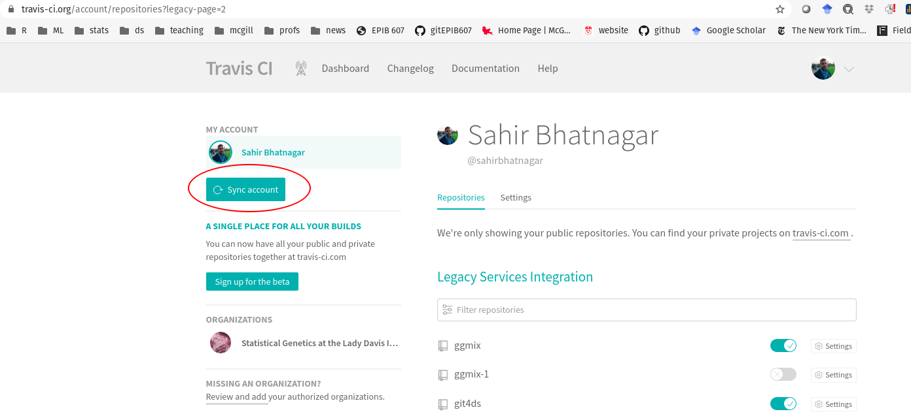

# Overview

In this post, I try to outline the steps needed to create a website for your R package using the [`pkgdown`](https://github.com/r-lib/pkgdown) package. In particular, I will show you how to get [Travis-ci](https://travis-ci.org/) to automatically build the website and deploy it to your `gh-pages` branch on GitHub. 

This tutorial assumes you have basic knowledge of Git commands pull, push, commit, and what a branch is. It also assumes working knowledge of R, and what continuous integration is. You must also have a GitHub account and have a [GitHub Pages user site](https://pages.github.com/). 

Note: the steps outlined below are a recollection of what I remember from recently doing the samething for our [`casebase` R package](http://sahirbhatnagar.com/casebase/). You can probably figure out most of this out using the documentation from the [`usethis`](https://usethis.r-lib.org/), [`pkgdown`](https://github.com/r-lib/pkgdown) and [`travis`](https://docs.ropensci.org/travis/) R packages. However, I found that certain pieces of information were missing or I had to search beyond these docs to make everything work. Please feel free to comment below if this tutorial doesn't work for you.

# Pre-requisites

1. A GitHub account
2. A [Travis-ci](https://travis-ci.org/) account linked to your GitHub account
3. The following R packages:

```{r, eval=FALSE}
install.packages(c("devtools","usethis","knitr","rmarkdown", "roxygen2", "pkgdown"))
devtools::install_github("ropenscilabs/travis")
```


# Step 1: Create an R package

To demonstrate creating a website for an R package, we will first create a very simple one. I have previously written [a more detailed tutorial on creating R packages](http://sahirbhatnagar.com/rpkg/) if you're interested. 

I will first create a package called `pkgdowntravis` locally into an empty folder of the same name with an RStudio project file, and then push it to my [remote repository](https://github.com/sahirbhatnagar/pkgdowntravis).  

```{r, eval=FALSE}
# setup R package structure
usethis::create_package("pkgdowntravis")

# created README.md for Github landing page
usethis::use_readme_md(open = FALSE)

# creates license file
usethis::use_mit_license("Sahir Bhatnagar")

# creates news file
usethis::use_news_md(open = FALSE)

# create a vignette
usethis::use_vignette("package_intro")
```

Create a `.gitignore` file in the root of the directory with the following two lines:

```{bash, eval=FALSE}
pkgdowntravis.Rproj
.Rproj*
```

Save the following R function in a file called `simdata.R` in the `R/` folder:

```{r, eval=FALSE}
#' Simulate Multivariate Normal Distribution
#' @description Custom function to simulate multivariate normal distribution
#' @param n sample size (integer)
#' @param p number of variables (integer)
#' @param rho correlation between variables (between 0 and 1)
#' @return A nxp matrix of simulated data
#' @references
#' \url{https://gallery.rcpp.org/articles/simulate-multivariate-normal/}
#' @examples
#' dat <- mvrnormR(n = 100, p = 10, rho = 0.8)
#' heatmap(cor(dat))
#' @export
mvrnormR <- function(n, p, rho) {

  # covariance between Z_i and Z_j being rho^|i-j|
  times <- 1:p # used for creating covariance matrix
  H <- abs(outer(times, times, "-"))
  sigma <- rho^H

  mu <- rep(0, p)
  ncols <- ncol(sigma)
  mu <- rep(mu, each = n) ## not obliged to use a matrix (recycling)
  mu + matrix(stats::rnorm(n * ncols), ncol = ncols) %*% chol(sigma)
}
```

Modify the vignette file found in the vignettes folder. I added the following code chunk:

```{r, eval=FALSE}
dat <- mvrnormR(n = 100, p = 10, rho = 0.8)
heatmap(cor(dat))
```

Create the documentation files and check that the package can build without errors:

```{r, eval=FALSE}
devtools::document()
devtools::check()
```


# Step 2: Initialize Git Repository

At this point you need to initialize the project as a git repo, commit your changes, set the remote and push to the remote. There are many ways to accomplish this [which I explain in my tutorial](http://sahirbhatnagar.com/rpkg/). Here I will use the command line to accomplish this:

```{bash, eval=FALSE}
git init
git add --all
git commit -m "initial commit"
git remote add origin https://github.com/sahirbhatnagar/pkgdowntravis.git
git push origin master
```


# Step 3: Setup Travis-CI

Continous integration (aka checking your package after every commit) is a software development technique used to ensure that any changes to your code do not break the package's functionality. Travis is a continuous integration service, which means that it runs automated testing code everytime you push to GitHub. For open source projects, Travis provides 50 minutes of free computation on a Ubuntu server for every push. For an `R` package, the most useful code to run is `devtools::check()`. Here we will also be using Travis to build and deploy our package website.

To start using Travis: 

1. Go to https://travis-ci.org and sign in with your GitHub account. 
2. Run `usethis::use_travis()` in the home directory of your R package.
3. Clicking on your name in the upper right hand corner of the site will bring up a list of your public GitHub repositories with a switch next to each repo. If you turn the switch on then the next time you push to that repository Travis will look for a `.travis.yml` file in the root of the repository, and it will run tests on your package accordingly (see images below):


```{r}

```


<br>

Scroll to the `pkgdowntravis` repository:

<br>


4. Now add, commit, and push your changes to GitHub, which will trigger the first build of your package on Travis. Go back to https://travis-ci.org to watch your package be built and tested at the same time! For further customizations to your .travis.yml file, see all of the options available in [this guide](https://docs.travis-ci.com/user/languages/r).


# Step 4: Initialize website using `pkgdown`

First initialize the website using the following command, which will basically setup the website skeleton for you:

```{r, eval=FALSE}
pkgdown::build_site()
```

This should automatically open up your web browser with the built website. The homepage should look like this:


You should additionally see that a `docs/` folder has been created in the root of your package directory which contains all the source files for your website. 


# Step 5: Host the website using GitHub Pages

Next we need to publish the website online. There are two ways I can think of to do this:

1) Non-automatic way (easy): this requires you to build the website locally everytime you make a change to the documentation or vignettes, and then push to github. But the setup is easy and probably the one I would recommend if you don't plan on making many changes to your package.

2) Automatic way (hard): this requires more initial setup and some understanding of the GitHub and Travis APIs. Once this is done however, you never need to worry about updating your website, because anytime you make a change to your package (and push these changes to GitHub), the website will automatically get updated because Travis will re-build the site and deploy on GitHub. 

I will outline both ways below.

## The easy way using the `docs/` folder

Commit the changes (the newly created `docs/` folder) and push them to the remote (on the master branch):

```{bash, eval=FALSE}
git add --all
git commit -m "added pkgdown files"
git push origin master
```

Then head over to the _Settings_ on your GitHub repo:


Scroll to the _GitHub Pages_ section and select _master branch /docs folder_ in the dropdown menu:


Refresh the page a few times and if all worked out you should see the following:


That's it! To update your website, simply re-build locally using `pkgdown::build_site()` and then push to GitHub. GitHub Pages will then always use the files in the `docs/` folder for the source code of your website. 


## The hard way using Travis

We first need to create a `YAML` file for `pkgdown` in the root of your package directory called `_pkgdown.yml`. This file basically has a set of instructions for `pkgdown` to follow and can be used to [further customize the site](https://pkgdown.r-lib.org/articles/pkgdown.html). Below is a very basic example. A more complicated example can be found in our [`casebase` package](https://github.com/sahirbhatnagar/casebase/blob/master/_pkgdown.yml). Copy the following into your `_pkgdown.yml` file:

```{yml, eval=FALSE}
url: http://sahirbhatnagar.com/pkgdowntravis

template:
  params:
    bootswatch: cosmo

authors:
  Sahir Bhatnagar:
    href: http://sahirbhatnagar.com/

development:
  mode: release
```

You then need to add this file to the `.Rbuildignore` so that R doesn't use this file in the build process (note that `usethis` will automatically escape special characters so I highly recommend this function so you don't have to worry about it):

```{r, eval=FALSE}
usethis::use_build_ignore(files = "_pkgdown.yml")
```


Next we need to create a [Deploy Key](https://developer.github.com/v3/guides/managing-deploy-keys/#deploy-keys), which is basically a way for Travis to securely have read and write access to the GitHub repository. This deploy key is stored securely on the repository of the package. The easiest way to do this (although it hides alot of the steps) is to use the `travis::use_travis_deploy()` function. However, before you can use this function, you must first give **R access to GitHub** via their API using a [Personal Access Token or PAT](https://help.github.com/en/github/authenticating-to-github/creating-a-personal-access-token-for-the-command-line). You must also give **R access to Travis** via their [API Key](https://docs.travis-ci.com/user/encryption-keys/). Confused yet? In summary, we must complete the following steps:

### 1. Create a GitHub PAT

Create a GitHub PAT with:

```{r, eval=FALSE}
usethis::browse_github_token()
```

Login to your GitHub account if prompted. Then you will see a page like this with repo and gist already selected:


Then click on the _Generate Token_ button:


COPY the GitHub PAT to your `_.Renviron` file. If you don't have one, create a file called `.Renviron` and save it in your home directory. The variables in the `.Renviron` file are available to your R session upon startup. Store your GitHub PAT with a line like:

```{bash, eval=FALSE}
GITHUB_PAT=paste your PAT here

# if you want to see if this worked, restart your R session
# then try the R command
system('echo $GITHUB_PAT')
```

### 2. Create a Travis API Key 

Generate a Travis API key with

```{r, eval=FALSE}
travis::browse_travis_token()
```

You will likely be prompted to logon to Travis:


Then you should be in the _Settings_ page of your Travis account. Under _API Authentication_, click on _Copy Token_:


Paste this token in your `.Renviron` file. Also take note of if you're using the `.com` or `.org` endpoint which you can tell by looking at the travis website address. Here I'm using the `.org` endpoint:

```{bash, eval=FALSE}
R_TRAVIS_ORG = paste your travis token here
```

If you're using the `.com` endpoint, you should enter the following in your `.Renviron` file:

```{bash, eval=FALSE}
# if you're using .com endpoint
R_TRAVIS_COM = paste your travis token here
```

Restart your R session before moving on to the next step so that the new R session has access to these environment variables. 

### 3. Create the Deploy key

Now that R has access to both GitHub and Travis, you can create the deploy key with 

```{r, eval=FALSE}
travis::use_travis_deploy()

# if the above doesn't work, try:
travis::use_travis_deploy(endpoint = '.org')
```

If that worked, you should see the following in R:


Head over to the _Settings_ page for the repo on Travis:


You should also see that there's an environment variable called `TRAVIS_DEPLOY_KEY`:


Add the following to your `.travis.yml` file which is found in the root of your package directory:

```{yml, eval=FALSE}
before_cache: Rscript -e 'remotes::install_cran("pkgdown")'
deploy:
  provider: script
  script: Rscript -e 'pkgdown::deploy_site_github(ssh_id = Sys.getenv("TRAVIS_DEPLOY_KEY", ""))'
  skip_cleanup: true
```

Commit and push your changes to the remote which should trigger a new build on Travis.


If everything worked you should see the following in your Travis build logs:


And the following on the `gh-pages` branch of your repository:


NOTE: According to [issue #1223](https://github.com/r-lib/pkgdown/issues/1223), this will fail if there doesn't exist a `gh-pages` branch on your GitHub repo. So if this did fail, follow the instructions to create an orphan `gh-pages` branch and then retart the travis build:

```{bash, eval=FALSE}
git checkout --orphan gh-pages
# Clean all (untracked) files:
git reset --hard or git rm -rf .
# Create first commit: 
git commit --allow-empty -m "Initializing gh-pages branch"
```


### 4. Change the source of your website

Head over to the settings of your GitHub repository, and scroll to the GitHub Pages section. Change the source to `gh-pages` branch:


# Conclusion

The hardest part for me is/was figuring out all of these API keys and tokens and PATs. The `usethis` and `travis` R packages have made it easier for us to use these complex tools, but this comes at the cost of understanding less about what's actually going on behind the scenes. In this post I try to reason out some of the inner workings of whats actually going on when you call these functions. I've learned that their approach is to create the necessary tokens and PATs, and then store them in the `.Renviron` so that these values are available to your R session. 


